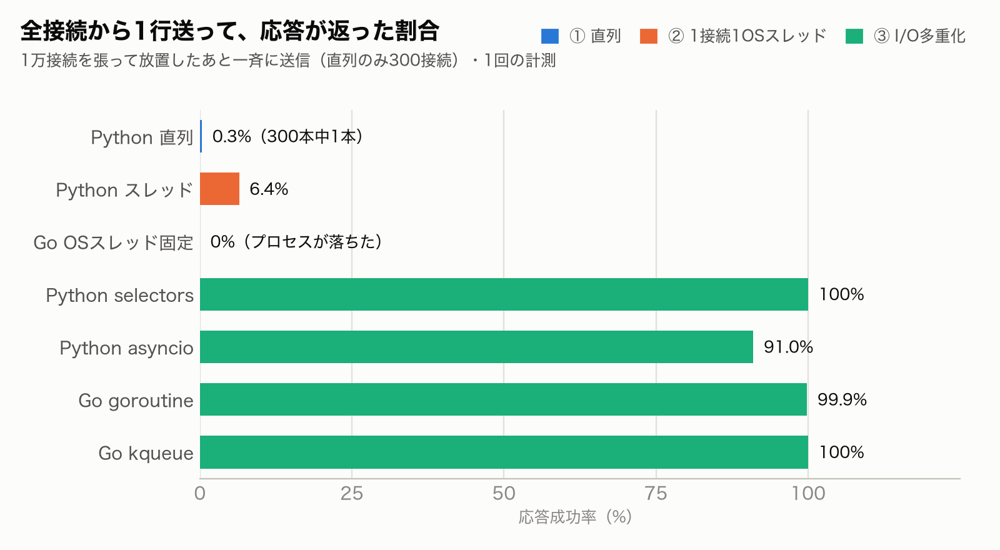
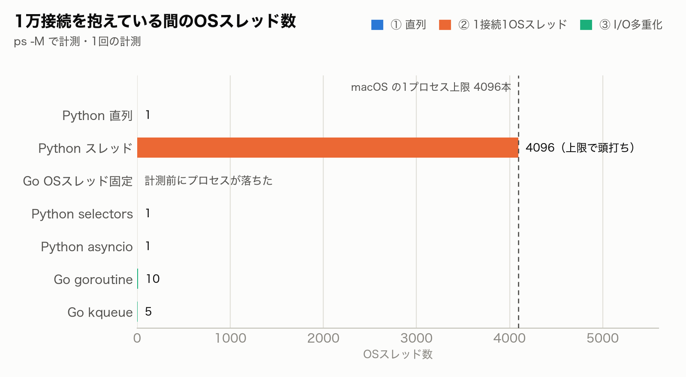
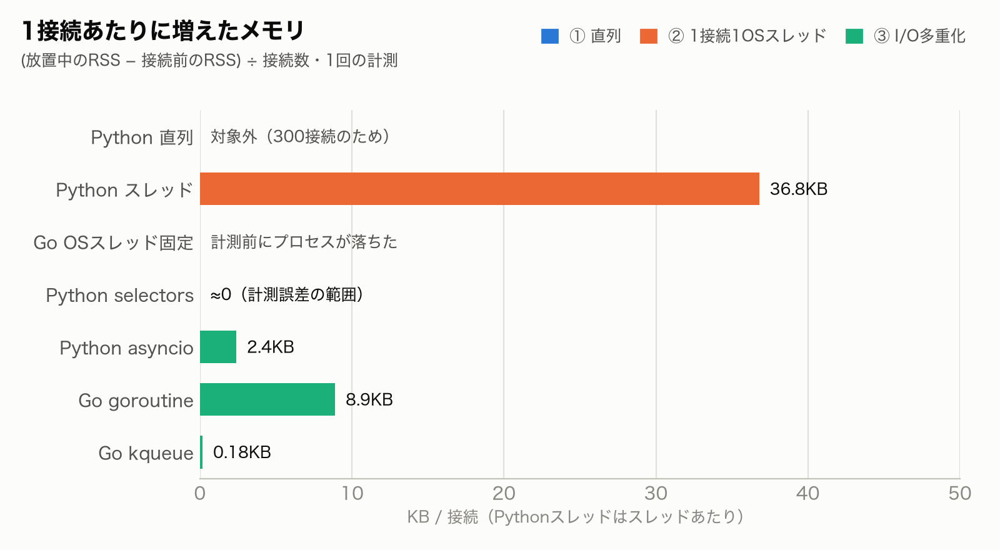
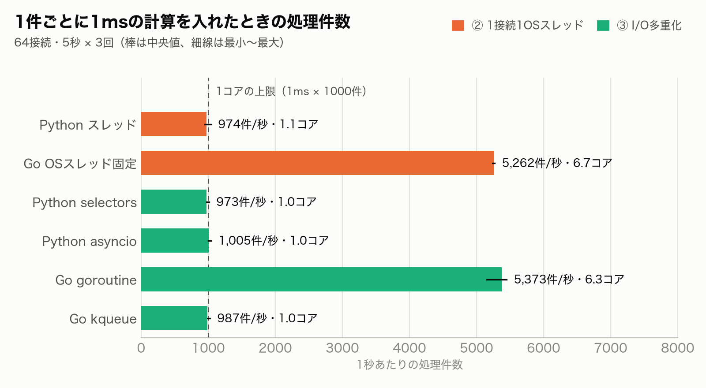
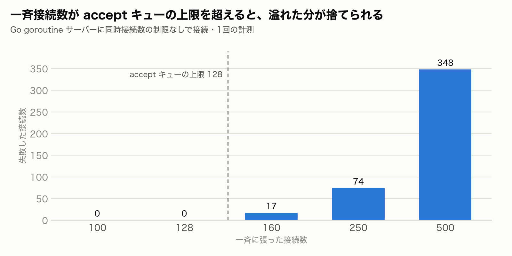

# C10K ベンチ

同じ「1行受け取ったら同じ1行を返す」エコーサーバーを Python と Go で7種類書き、次の2つを比べる。

1. **1万接続**を張って放置したときの OS スレッド数・メモリと、全接続から一斉に送ったときの応答成功率
2. 1件ごとに **1ms の CPU 計算**を入れたときの、1秒あたりの処理件数と使えた CPU コア数

| サーバー | 言語 | 方式 | ファイル |
|---|---|---|---|
| 直列 | Python | ① 直列 | `python/sequential.py` |
| スレッド | Python | ② 1接続1OSスレッド | `python/threads.py` |
| OSスレッド固定 | Go | ② 1接続1OSスレッド | `go/goroutine/`（`-lock-os-thread` 付き） |
| selectors | Python | ③ I/O多重化（手書き） | `python/select_loop.py` |
| asyncio | Python | ③ I/O多重化 | `python/async_server.py` |
| goroutine | Go | ③ I/O多重化（ランタイムが担当） | `go/goroutine/` |
| kqueue | Go | ③ I/O多重化（手書き） | `go/kqueue/` |

## 計測結果

計測環境: Apple M1（高性能コア4つ + 高効率コア4つ）/ メモリ16GB / macOS 14.7.8 / Go 1.26.7 / Python 3.13.3。サーバーと負荷クライアントは同じ Mac 上で動かしている。

### 1. 1万接続（`bench.sh`、1回の計測）







| サーバー | 応答成功 | OSスレッド（放置中） | メモリ（放置中） |
|---|---|---|---|
| Python 直列（300接続） | 1 / 300 | 1 | 11.5MB |
| Python スレッド | 643 / 10000 | 4096（上限） | 159.3MB |
| Go OSスレッド固定 | 0 / 10000 | プロセスが落ちた | — |
| Python selectors | 10000 / 10000 | 1 | 10.5MB |
| Python asyncio | 9102 / 10000 | 1 | 43.6MB |
| Go goroutine | 9985 / 10000 | 10 | 91.6MB |
| Go kqueue | 10000 / 10000 | 5 | 5.4MB |

asyncio と goroutine の失敗は、接続が速すぎて accept キューから溢れた分。負荷側の接続ペースを落とすと、それぞれ 9990 / 9998、10000 / 10000 になった。

### 2. 1件ごとに1msの計算（`cpu-bench.sh`、64接続・5秒・3回の中央値）



| サーバー | 処理件数 | 使った CPU コア |
|---|---|---|
| Python スレッド | 974 件/秒 | 1.1 |
| Go OSスレッド固定 | 5,262 件/秒 | 6.7 |
| Python selectors | 973 件/秒 | 1.0 |
| Python asyncio | 1,005 件/秒 | 1.0 |
| Go goroutine | 5,373 件/秒 | 6.3 |
| Go kqueue | 987 件/秒 | 1.0 |

使った CPU コアは「サーバーが使った CPU 時間 ÷ 経過時間」。

### 3. accept キューの溢れ



負荷側から一斉に接続すると、128本（macOS の `kern.ipc.somaxconn`）を超えたところから接続が捨てられる。そのため `loadgen` は同時に接続を試みる数を50本に抑えている。

## 分かったこと

- **1接続1OSスレッドは4096本で止まる。** macOS の1プロセスあたりのスレッド上限（`kern.num_taskthreads`）。Python は接続を断りながら動き続け、Go はプロセスごと落ちた
- **I/O多重化なら OS スレッド1本でも1万接続を抱えられる。** Python でも Go でも同じで、差は言語ではなく方式で決まる
- **goroutine は OS スレッドではない。** 同じコードに `runtime.LockOSThread()` を1行足すと、1接続1OSスレッドになって同じ壁で落ちる
- **スレッド1本のイベントループは1コアしか使えない。** 重い計算が入ると kqueue / selectors / asyncio は約1000件/秒で頭打ちになり、goroutine は複数コアを使って約5.4倍を捌いた。Python はスレッドにしても GIL のせいで1コア
- 実用では、Go なら goroutine、Python なら asyncio（複数コアを使うならプロセスを複数立てる）。kqueue / epoll の手書きは学習用か、性能を詰めるミドルウェア向け

## ファイル構成

```
python/         直列・スレッド・selectors・asyncio のサーバー
  work.py       1件ごとに WORK_MS ミリ秒の CPU 計算をさせる部品（未指定なら何もしない）
go/
  goroutine/    goroutine 版（-lock-os-thread で1接続1OSスレッドを再現）
  kqueue/       kqueue を直接使った I/O多重化版（macOS / BSD 専用）
  cpuwork/      work.py の Go 版
  loadgen/      1万接続用の負荷クライアント（接続数・OSスレッド数・メモリを計測）
  cpuload/      処理件数と使った CPU コア数を測るクライアント
bench.sh        1万接続を張って全サーバーを順に計測する
cpu-bench.sh    1件ごとに重い計算を入れて処理件数を比べる
charts.py       計測結果のグラフを images/ に出力する（数値は手で書き写している）
images/         計測結果のグラフ
```

## 動かし方

リポジトリのルートで実行する。

```bash
./c10k/bench.sh
./c10k/cpu-bench.sh
```

| スクリプト | 変数 | 既定値 | 意味 |
|---|---|---|---|
| `bench.sh` | `N` | 10000 | 接続数 |
| | `N_SEQ` | 300 | 直列サーバーだけの接続数 |
| | `COOLDOWN` | 35 | 回ごとの待ち時間（秒）。前の回の TIME_WAIT が明けるのを待つ |
| | 第1引数 | — | `go-kqueue` などサーバー名を指定すると1つだけ実行 |
| `cpu-bench.sh` | `WORK_MS` | 1 | 1件ごとの CPU 計算の量（ミリ秒） |
| | `C` | 64 | 接続数 |
| | `DURATION` | 5s | 計測時間 |

グラフの作り直し（`matplotlib` が必要）:

```bash
./.venv/bin/pip install matplotlib
./.venv/bin/python c10k/charts.py
```

## 注意

- 1万接続の計測は1回だけ。数値には誤差があり、たとえば asyncio の1接続あたりのメモリは測り直すと約2.4KBから約5KBに変わった
- 1万接続の計測では応答時間を比べていない。負荷クライアントも同じ Mac 上で CPU を使うため
- スレッド上限の4096、accept キュー上限の128は、今回の macOS の設定値。OS や設定によって変わる
- `bench.sh` と `cpu-bench.sh` は macOS 専用（他の OS では最初にエラーで止まる）。`go/kqueue/` は macOS / BSD 向けで、`loadgen` のスレッド数の計測も macOS の `ps -M` に依存している。Linux で動かすには kqueue 版を epoll で書き直し、スレッド数を `/proc/<PID>/status` などから取る必要がある
