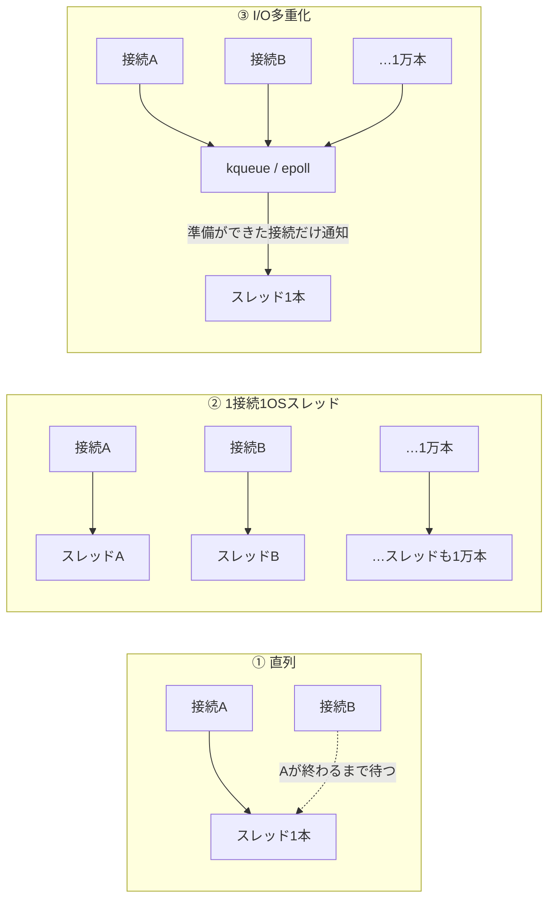

<!--
タイトル案: C10K問題を手元のMacで再現する ― PythonとGoの7種類のサーバーに1万接続を張って比べた
タグ案: Go Python ネットワーク C10K 非同期処理
画像: c10k/images/ の4枚を Qiita のエディタにドラッグ&ドロップでアップロードし、本文中の images/... のパスを置き換えてください。
-->

## はじめに

「C10K問題」は名前こそよく聞きますが、手元で実際に起こしてみたことはありませんでした。そこで「1行受け取ったら同じ1行を返す」だけのエコーサーバーを Python と Go で計7種類書き、それぞれに1万本の接続を張って何が起きるかを測りました。

先に結論です。

- **1接続1OSスレッド方式は、1万接続に届く前に OS のスレッド上限（今回の macOS では1プロセス4096本）で止まりました。** Python は接続を断りながら動き続け、Go はプロセスごと落ちました
- **I/O多重化を使えば、OSスレッド1本でも1万接続を全部捌けました。** Python でも Go でも同じです
- Go の goroutine は、**同じコードに `runtime.LockOSThread()` を1行足すだけで**「1接続1OSスレッド」になり、同じ壁で落ちます。goroutine が OS スレッドではないことが数字で確認できます
- 差を生んだのは言語ではなく**方式**でした

コードは GitHub に置いています: https://github.com/yosuke318/network-programming-lab/tree/main/c10k

## C10K問題とは

### 名前の意味

| 文字 | 意味 |
|---|---|
| C | Client（クライアント） |
| 10 | 10 |
| K | Kilo（1,000） |

「クライアント1万台の同時接続を1台のサーバーでどう捌くか」という問題です。1999年に Dan Kegel が提起したことで知られています。

### なぜ 1接続1スレッドだと厳しいのか

接続ごとに OS スレッドを1本割り当てる作りは書きやすい反面、接続数が増えると次の問題が出ます。

- スレッドごとにスタック用のメモリが要る
- OS が大量のスレッドを切り替えるコストがかかる
- 接続のほとんどは相手の応答を待っているだけで、スレッドは何もせずに資源だけを使っている

解決の方向は「少ないスレッドで多数のソケットを見張り、データが届いたものだけ処理する」、つまり **I/O多重化** です。OS はそのための仕組みとして、Linux では epoll、macOS / BSD では kqueue を用意しています。

### 今回比べる3つの方式



| 方式 | 同時に捌けるか | 1万接続で必要な OS スレッド |
|---|---|---|
| ① 直列 | 捌けない（1人ずつ） | 1本 |
| ② 1接続1OSスレッド | 捌ける | 1万本 |
| ③ I/O多重化 | 捌ける | 数本 |

## 実験の方法

### 環境

| 項目 | 値 |
|---|---|
| マシン | Mac（Apple M1 / 8コア / メモリ16GB） |
| OS | macOS 14.7.8 |
| Go | 1.26.7 |
| Python | 3.13.3 |
| 1プロセスあたりのスレッド上限 | 4096（`sysctl kern.num_taskthreads`） |
| accept キューの上限 | 128（`sysctl kern.ipc.somaxconn`） |
| 1プロセスあたりのファイルディスクリプタ上限 | 61440（`sysctl kern.maxfilesperproc`） |

サーバーと負荷クライアントは同じ Mac 上で動かし、通信はループバック（127.0.0.1）です。

### プロトコル

全サーバー共通で「改行までを1行として受け取り、同じ行をそのまま返す」だけです。

### 負荷クライアントの動き

Go で書いた負荷クライアント（`loadgen`）が次の3段階を行います。

1. 1万本の接続を張る（同時に接続を試みるのは50本まで。理由は後述）
2. 何も送らずに2秒放置し、その間のサーバーの OS スレッド数とメモリ（RSS）を測る
3. 全接続から同時に `ping\n` を送り、3秒以内に同じ行が返ってくるか確かめる

C10K で問題になるのは「大量の接続を抱えていること」そのものなので、2 の放置が本題です。OS スレッド数は `ps -M -p <PID>` の行数、メモリは `ps -o rss= -p <PID>` で取っています。

### 7つのサーバー

| 名前 | 言語 | 方式 | ファイル |
|---|---|---|---|
| 直列 | Python | ① | `c10k/python/sequential.py` |
| スレッド | Python | ② | `c10k/python/threads.py` |
| OSスレッド固定 | Go | ② | `c10k/go/goroutine/main.go`（`-lock-os-thread` 付き） |
| selectors | Python | ③（手書き） | `c10k/python/select_loop.py` |
| asyncio | Python | ③ | `c10k/python/async_server.py` |
| goroutine | Go | ③（ランタイムが多重化） | `c10k/go/goroutine/main.go` |
| kqueue | Go | ③（手書き） | `c10k/go/kqueue/main.go` |

直列サーバーは1人ずつしか処理できず、残りは接続のタイムアウトを待つだけで時間がかかるので、300接続で測っています。

## 7つのサーバーのコード

### ① 直列（Python）

```python:c10k/python/sequential.py
"""① 直列。従来の書き方（書籍のサーバーと同じ構造）の行エコーサーバー。

accept → 処理 → accept の順に回るので、1人目が繋がっている間は2人目を処理できない。
"""

import os
import socket

PORT = 9100


def main():
    sock = socket.socket(socket.AF_INET, socket.SOCK_STREAM)
    sock.setsockopt(socket.SOL_SOCKET, socket.SO_REUSEADDR, 1)
    sock.bind(('127.0.0.1', PORT))
    sock.listen(128)
    print('sequential server on 127.0.0.1:{} pid={}'.format(PORT, os.getpid()), flush=True)

    while True:
        conn, _ = sock.accept()
        try:
            with conn, conn.makefile('rwb') as stream:
                for line in stream:
                    stream.write(line)
                    stream.flush()
        except OSError:
            pass


if __name__ == '__main__':
    main()
```

`accept` → 処理 → `accept` の順に回るので、1人目が繋がっている間は2人目の番が来ません。

### ② 1接続1スレッド（Python）

```python:c10k/python/threads.py
"""② 1接続1スレッドの行エコーサーバー。

接続ごとにOSスレッドを1本作る。書き方は①とほぼ同じで、並行に捌ける。
ただしスレッドはメモリを食い、OSの上限（macOS は1プロセス4096本）で頭打ちになる。
"""

import os
import socket
import threading

PORT = 9101


def handle(conn):
    try:
        with conn, conn.makefile('rwb') as stream:
            for line in stream:
                stream.write(line)
                stream.flush()
    except OSError:
        pass


def main():
    sock = socket.socket(socket.AF_INET, socket.SOCK_STREAM)
    sock.setsockopt(socket.SOL_SOCKET, socket.SO_REUSEADDR, 1)
    sock.bind(('127.0.0.1', PORT))
    sock.listen(128)
    print('threads server on 127.0.0.1:{} pid={}'.format(PORT, os.getpid()), flush=True)

    failed = 0
    while True:
        conn, _ = sock.accept()
        try:
            threading.Thread(target=handle, args=(conn,), daemon=True).start()
        except RuntimeError as err:
            # OSがこれ以上スレッドを作らせてくれない。これが C10K の壁。
            failed += 1
            if failed == 1 or failed % 1000 == 0:
                print('thread creation failed x{}: {} (active threads={})'.format(
                    failed, err, threading.active_count()), flush=True)
            conn.close()


if __name__ == '__main__':
    main()
```

① との違いは、`accept` した接続をスレッドに渡すところだけです。スレッドを作れなかったときの `RuntimeError` を拾い、その回数をログに出しています。

### Go の goroutine と、② の再現（`LockOSThread` の1行）

```go:c10k/go/goroutine/main.go
// 従来のGoの書き方。1接続に1 goroutine を割り当てる行エコーサーバー。
//
// -lock-os-thread を付けると、各 goroutine を専用のOSスレッドに固定する。
// 違いは runtime.LockOSThread() の1行だけ。これで「1接続1スレッド」方式を再現できる。
package main

import (
	"bufio"
	"flag"
	"log"
	"net"
	"os"
	"runtime"
)

func main() {
	addr := flag.String("addr", "127.0.0.1:9200", "待ち受けアドレス")
	lock := flag.Bool("lock-os-thread", false, "goroutine をOSスレッドに固定する（1接続1スレッドの再現）")
	flag.Parse()

	ln, err := net.Listen("tcp", *addr)
	if err != nil {
		log.Fatal(err)
	}
	log.Printf("goroutine server on %s lock-os-thread=%v pid=%d", *addr, *lock, os.Getpid())

	for {
		conn, err := ln.Accept()
		if err != nil {
			log.Println("accept:", err)
			continue
		}
		go func() {
			if *lock {
				// この goroutine が終わるまで、OSスレッドを1本占有する。
				runtime.LockOSThread()
			}
			handle(conn)
		}()
	}
}

func handle(conn net.Conn) {
	defer conn.Close()
	br := bufio.NewReader(conn)
	for {
		// データが来るまでここで止まるが、止まるのは goroutine だけ。
		// OSスレッドはランタイムが別の goroutine の実行に回す。
		line, err := br.ReadBytes('\n')
		if err != nil {
			return
		}
		if _, err := conn.Write(line); err != nil {
			return
		}
	}
}
```

普段の Go の書き方です。`-lock-os-thread` を付けたときだけ `runtime.LockOSThread()` が呼ばれ、その goroutine が終わるまで OS スレッドを1本占有します。**違いはこの1行だけ**なので、goroutine と OS スレッドを直接比べられます。

### ③ I/O多重化を手で書く（Python selectors）

`selectors.DefaultSelector()` は、macOS では kqueue、Linux では epoll を使います。中心はこのループです。

```python
while True:
    # 何か起きるまでここで眠る。1万接続あっても、返ってくるのは準備ができた分だけ。
    for key, mask in sel.select():
        if key.fileobj.fileno() == -1:  # 同じ周回の中で既に閉じたもの
            continue
        if key.data is None:
            accept(key.fileobj)
        else:
            on_event(key.fileobj, key.data, mask)
```

スレッドを使わないので、「改行が来るまで溜めている受信データ」と「送りきれなかった応答」を接続ごとに自分で持つ必要があります。

<details><summary>全体（c10k/python/select_loop.py）</summary>

```python:c10k/python/select_loop.py
"""③ I/O多重化（手書き）の行エコーサーバー。

スレッドは1本だけ。selectors が OS の kqueue（Linux なら epoll）を使い、
「読める / 書けるソケット」だけを教えてもらって順に処理する。

スレッドが無いので、接続ごとの状態（読みかけのデータ、送り残し）を自分で持つ必要がある。
①②では makefile とスレッドが暗黙にやってくれていた部分。

※ ファイル名を selectors.py にすると標準ライブラリを上書きしてしまうので避けている。
"""

import os
import selectors
import socket

PORT = 9102

sel = selectors.DefaultSelector()


class Conn:
    __slots__ = ('inbuf', 'outbuf')

    def __init__(self):
        self.inbuf = b''   # 改行が来るまで溜めておく受信データ
        self.outbuf = b''  # 送りきれなかった応答


def accept(lsock):
    # 1回の通知で複数の接続が待っていることがあるので、空になるまで受け取る。
    while True:
        try:
            conn, _ = lsock.accept()
        except BlockingIOError:
            return
        conn.setblocking(False)
        sel.register(conn, selectors.EVENT_READ, Conn())


def close(sock):
    sel.unregister(sock)
    sock.close()


def on_event(sock, state, mask):
    if mask & selectors.EVENT_READ:
        try:
            data = sock.recv(4096)
        except BlockingIOError:
            data = None
        except OSError:
            close(sock)
            return
        if data == b'':  # 相手が閉じた（EOF）
            close(sock)
            return
        if data:
            # 届いた分を溜め、改行が揃った行だけ応答に回す。
            state.inbuf += data
            while b'\n' in state.inbuf:
                line, _, state.inbuf = state.inbuf.partition(b'\n')
                state.outbuf += line + b'\n'

    if state.outbuf:
        try:
            sent = sock.send(state.outbuf)
            state.outbuf = state.outbuf[sent:]
        except BlockingIOError:
            pass
        except OSError:
            close(sock)
            return

    # 送り残しがある時だけ「書けるようになったら教えて」と頼む。
    want = selectors.EVENT_READ | (selectors.EVENT_WRITE if state.outbuf else 0)
    if sel.get_key(sock).events != want:
        sel.modify(sock, want, state)


def main():
    lsock = socket.socket(socket.AF_INET, socket.SOCK_STREAM)
    lsock.setsockopt(socket.SOL_SOCKET, socket.SO_REUSEADDR, 1)
    lsock.bind(('127.0.0.1', PORT))
    lsock.listen(128)
    # ノンブロッキングにしないと accept や recv で眠ってしまい、他の接続を捌けない。
    lsock.setblocking(False)
    sel.register(lsock, selectors.EVENT_READ, None)
    print('select-loop server ({}) on 127.0.0.1:{} pid={}'.format(
        type(sel).__name__, PORT, os.getpid()), flush=True)

    while True:
        # 何か起きるまでここで眠る。1万接続あっても、返ってくるのは準備ができた分だけ。
        for key, mask in sel.select():
            if key.fileobj.fileno() == -1:  # 同じ周回の中で既に閉じたもの
                continue
            if key.data is None:
                accept(key.fileobj)
            else:
                on_event(key.fileobj, key.data, mask)


if __name__ == '__main__':
    main()
```

</details>

### ③ I/O多重化を手で書く（Go kqueue）

Go の `net` パッケージを使わず、`socket()` / `bind()` / `listen()` / `accept()` と kqueue を直接呼んでいます。goroutine はメインの1本だけです。中心はこのループです（抜粋）。

```go
for {
	// 何か起きるまでここで眠る。1万接続あっても、起こされるのは準備ができた分だけ。
	n, err := syscall.Kevent(kq, nil, events, nil)
	// （エラー処理は省略）
	for _, ev := range events[:n] {
		fd := int(ev.Ident)
		switch {
		case fd == lfd:
			acceptAll(kq, lfd, conns)
		case ev.Filter == syscall.EVFILT_READ:
			onReadable(kq, fd, conns, buf)
		case ev.Filter == syscall.EVFILT_WRITE:
			if c := conns[fd]; c != nil {
				flush(kq, fd, c, conns)
			}
		}
	}
}
```

Go のランタイムが goroutine の裏でやっていることを、手で書くとこうなります。

<details><summary>全体（c10k/go/kqueue/main.go）</summary>

```go:c10k/go/kqueue/main.go
//go:build darwin

// kqueue を直接使った I/O多重化の行エコーサーバー（macOS / BSD 専用。Linux なら epoll を使う）。
//
// goroutine はメインの1本だけ。「読めるソケットはどれか」をOSに教えてもらい、
// 届いたものから順に処理する。Goのランタイムが goroutine の裏でやっていることを
// 手で書くとこうなる。
//
// net パッケージを使わず、socket() / bind() / listen() / accept() を直接呼んでいる。
package main

import (
	"bytes"
	"errors"
	"log"
	"os"
	"syscall"
)

const port = 9202

// スレッドを使わないので、接続ごとの状態は自分で持つ必要がある。
// goroutine 版では bufio.Reader とスタック上の変数が暗黙に持っていたもの。
type conn struct {
	in       []byte // 改行が来るまで溜めておく受信データ
	out      []byte // 送りきれなかった応答
	watching bool   // 「書けるようになったら教えて」を登録中か
}

func main() {
	lfd, err := listen(port)
	if err != nil {
		log.Fatal(err)
	}
	kq, err := syscall.Kqueue()
	if err != nil {
		log.Fatal(err)
	}
	register(kq, lfd, syscall.EVFILT_READ, syscall.EV_ADD)
	log.Printf("kqueue server on 127.0.0.1:%d pid=%d", port, os.Getpid())

	conns := map[int]*conn{}
	events := make([]syscall.Kevent_t, 256)
	buf := make([]byte, 4096)

	for {
		// 何か起きるまでここで眠る。1万接続あっても、起こされるのは準備ができた分だけ。
		n, err := syscall.Kevent(kq, nil, events, nil)
		if err != nil {
			if errors.Is(err, syscall.EINTR) {
				continue
			}
			log.Fatal(err)
		}
		for _, ev := range events[:n] {
			fd := int(ev.Ident)
			switch {
			case fd == lfd:
				acceptAll(kq, lfd, conns)
			case ev.Filter == syscall.EVFILT_READ:
				onReadable(kq, fd, conns, buf)
			case ev.Filter == syscall.EVFILT_WRITE:
				if c := conns[fd]; c != nil {
					flush(kq, fd, c, conns)
				}
			}
		}
	}
}

func listen(port int) (int, error) {
	fd, err := syscall.Socket(syscall.AF_INET, syscall.SOCK_STREAM, 0)
	if err != nil {
		return -1, err
	}
	if err := syscall.SetsockoptInt(fd, syscall.SOL_SOCKET, syscall.SO_REUSEADDR, 1); err != nil {
		return -1, err
	}
	if err := syscall.Bind(fd, &syscall.SockaddrInet4{Port: port, Addr: [4]byte{127, 0, 0, 1}}); err != nil {
		return -1, err
	}
	if err := syscall.Listen(fd, 128); err != nil {
		return -1, err
	}
	// ノンブロッキングにしておかないと、accept や read で眠ってしまい他の接続を捌けない。
	if err := syscall.SetNonblock(fd, true); err != nil {
		return -1, err
	}
	return fd, nil
}

func acceptAll(kq, lfd int, conns map[int]*conn) {
	// 1回の通知で複数の接続が待っていることがあるので、空になるまで受け取る。
	for {
		nfd, _, err := syscall.Accept(lfd)
		if err != nil {
			if !errors.Is(err, syscall.EAGAIN) && !errors.Is(err, syscall.ECONNABORTED) {
				log.Println("accept:", err)
			}
			return
		}
		if err := syscall.SetNonblock(nfd, true); err != nil {
			syscall.Close(nfd)
			continue
		}
		register(kq, nfd, syscall.EVFILT_READ, syscall.EV_ADD)
		conns[nfd] = &conn{}
	}
}

func onReadable(kq, fd int, conns map[int]*conn, buf []byte) {
	c := conns[fd]
	if c == nil {
		return
	}
	n, err := syscall.Read(fd, buf)
	if err != nil {
		if errors.Is(err, syscall.EAGAIN) {
			return
		}
		closeConn(fd, conns)
		return
	}
	if n == 0 { // 相手が閉じた（EOF）
		closeConn(fd, conns)
		return
	}

	// 届いた分を溜め、改行が揃った行だけ応答に回す。境界問題はここでも自分で解く。
	c.in = append(c.in, buf[:n]...)
	for {
		i := bytes.IndexByte(c.in, '\n')
		if i < 0 {
			break
		}
		c.out = append(c.out, c.in[:i+1]...)
		c.in = c.in[i+1:]
	}
	flush(kq, fd, c, conns)
}

func flush(kq, fd int, c *conn, conns map[int]*conn) {
	for len(c.out) > 0 {
		n, err := syscall.Write(fd, c.out)
		if err != nil {
			if errors.Is(err, syscall.EAGAIN) {
				break // 送信バッファが一杯。書けるようになったら続きを送る
			}
			closeConn(fd, conns)
			return
		}
		c.out = c.out[n:]
	}

	switch {
	case len(c.out) > 0 && !c.watching:
		register(kq, fd, syscall.EVFILT_WRITE, syscall.EV_ADD)
		c.watching = true
	case len(c.out) == 0 && c.watching:
		register(kq, fd, syscall.EVFILT_WRITE, syscall.EV_DELETE)
		c.watching = false
	}
}

func closeConn(fd int, conns map[int]*conn) {
	// close すると kqueue への登録も自動で消える。
	syscall.Close(fd)
	delete(conns, fd)
}

func register(kq, fd, filter, flags int) {
	var ev syscall.Kevent_t
	syscall.SetKevent(&ev, fd, filter, flags)
	if _, err := syscall.Kevent(kq, []syscall.Kevent_t{ev}, nil, nil); err != nil {
		log.Printf("kevent fd=%d: %v", fd, err)
	}
}
```

</details>

### ③ asyncio（Python）

```python:c10k/python/async_server.py
"""③ I/O多重化（asyncio）の行エコーサーバー。

中身は select_loop.py と同じイベントループ（macOS なら kqueue）で、スレッドは1本だけ。
それでも await のおかげで、①②と同じ「1接続ずつ上から下へ」の書き方に戻っている。

※ ファイル名を asyncio.py にすると標準ライブラリを上書きしてしまうので避けている。
"""

import asyncio
import os

PORT = 9103


async def handle(reader, writer):
    try:
        # データが来るまで待つ間、イベントループは他の接続の処理に回る。
        while line := await reader.readline():
            writer.write(line)
            await writer.drain()
    except OSError:
        pass
    finally:
        writer.close()


async def main():
    server = await asyncio.start_server(handle, '127.0.0.1', PORT, backlog=128)
    print('asyncio server on 127.0.0.1:{} pid={}'.format(PORT, os.getpid()), flush=True)
    async with server:
        await server.serve_forever()


if __name__ == '__main__':
    asyncio.run(main())
```

中身は selectors 版と同じイベントループで、スレッドは1本です。それでも `await` のおかげで、① ② と同じ「1接続ずつ上から下へ」の書き方に戻っています。

### 負荷クライアントとベンチスクリプト

<details><summary>負荷クライアント（c10k/go/loadgen/main.go）</summary>

```go:c10k/go/loadgen/main.go
// C10K の負荷をかけるクライアント。
//
//  1. n 本の接続を張る
//  2. 何も送らずに放置し、その間のサーバーのスレッド数とメモリを測る
//     （C10K の接続の大半は「待っているだけ」なので、それを再現する）
//  3. 全接続から同時に1行送り、応答が返ってくるか確かめる
package main

import (
	"bufio"
	"errors"
	"flag"
	"fmt"
	"io"
	"net"
	"os/exec"
	"sort"
	"strconv"
	"strings"
	"sync"
	"syscall"
	"time"
)

func main() {
	addr := flag.String("addr", "127.0.0.1:9200", "接続先")
	n := flag.Int("n", 10000, "接続数")
	pid := flag.Int("pid", 0, "計測するサーバーのPID（0なら計測しない）")
	// accept キューの上限（macOS の somaxconn は128）を超えて一斉に接続すると、
	// 溢れた分をカーネルが捨ててしまい、サーバー方式の比較にならない。なので128未満に抑える。
	dialConcurrency := flag.Int("dial-concurrency", 50, "同時に接続を試みる数")
	timeout := flag.Duration("timeout", 3*time.Second, "接続・応答のタイムアウト")
	hold := flag.Duration("hold", 2*time.Second, "放置する時間")
	flag.Parse()

	fmt.Printf("target=%s n=%d\n", *addr, *n)
	if *pid > 0 {
		fmt.Printf("server before : %s\n", sample(*pid))
	}

	// 1. 接続を張る
	conns := make([]net.Conn, *n)
	dialErrs := newCounter()
	sem := make(chan struct{}, *dialConcurrency)
	var wg sync.WaitGroup
	start := time.Now()
	for i := range *n {
		wg.Add(1)
		sem <- struct{}{}
		go func() {
			defer wg.Done()
			defer func() { <-sem }()
			c, err := net.DialTimeout("tcp", *addr, *timeout)
			if err != nil {
				dialErrs.add(classify(err))
				return
			}
			conns[i] = c
		}()
	}
	wg.Wait()
	connected := 0
	for _, c := range conns {
		if c != nil {
			connected++
		}
	}
	fmt.Printf("connect       : %d ok / %d failed (%.2fs)%s\n",
		connected, *n-connected, time.Since(start).Seconds(), dialErrs)

	// 2. 放置して計測
	time.Sleep(*hold)
	if *pid > 0 {
		fmt.Printf("server holding: %s\n", sample(*pid))
	}

	// 3. 全接続から同時に1行送る
	var mu sync.Mutex
	var latencies []time.Duration
	pingErrs := newCounter()
	start = time.Now()
	for _, c := range conns {
		if c == nil {
			continue
		}
		wg.Add(1)
		go func() {
			defer wg.Done()
			t0 := time.Now()
			c.SetDeadline(t0.Add(*timeout))
			if _, err := io.WriteString(c, "ping\n"); err != nil {
				pingErrs.add(classify(err))
				return
			}
			line, err := bufio.NewReader(c).ReadString('\n')
			if err != nil {
				pingErrs.add(classify(err))
				return
			}
			if line != "ping\n" {
				pingErrs.add("bad reply")
				return
			}
			mu.Lock()
			latencies = append(latencies, time.Since(t0))
			mu.Unlock()
		}()
	}
	wg.Wait()
	fmt.Printf("ping          : %d ok / %d failed (%.2fs) p50=%v p99=%v%s\n",
		len(latencies), connected-len(latencies), time.Since(start).Seconds(),
		percentile(latencies, 50), percentile(latencies, 99), pingErrs)
	if *pid > 0 {
		fmt.Printf("server after  : %s\n", sample(*pid))
	}

	for _, c := range conns {
		if c != nil {
			c.Close()
		}
	}
}

// ps でサーバーのOSスレッド数と常駐メモリ(RSS)を取る。macOS の ps 前提。
func sample(pid int) string {
	p := strconv.Itoa(pid)
	rss, err := exec.Command("ps", "-o", "rss=", "-p", p).Output()
	if err != nil {
		return "プロセスが存在しない（落ちた）"
	}
	// ps -M はヘッダー1行 + スレッドごとに1行を出す。
	out, _ := exec.Command("ps", "-M", "-p", p).Output()
	threads := strings.Count(strings.TrimSpace(string(out)), "\n")
	kb, _ := strconv.Atoi(strings.TrimSpace(string(rss)))
	return fmt.Sprintf("threads=%d rss=%.1fMB", threads, float64(kb)/1024)
}

func classify(err error) string {
	var ne net.Error
	switch {
	case errors.As(err, &ne) && ne.Timeout():
		return "timeout"
	case errors.Is(err, io.EOF):
		return "EOF"
	case errors.Is(err, syscall.ECONNRESET):
		return "connection reset"
	case errors.Is(err, syscall.ECONNREFUSED):
		return "connection refused"
	case errors.Is(err, syscall.EPIPE):
		return "broken pipe"
	case errors.Is(err, syscall.EADDRNOTAVAIL):
		return "no ephemeral port"
	}
	return err.Error()
}

func percentile(ds []time.Duration, p int) time.Duration {
	if len(ds) == 0 {
		return 0
	}
	s := append([]time.Duration(nil), ds...)
	sort.Slice(s, func(i, j int) bool { return s[i] < s[j] })
	return s[(len(s)-1)*p/100].Round(time.Microsecond)
}

type counter struct {
	mu sync.Mutex
	m  map[string]int
}

func newCounter() *counter { return &counter{m: map[string]int{}} }

func (c *counter) add(k string) {
	c.mu.Lock()
	c.m[k]++
	c.mu.Unlock()
}

func (c *counter) String() string {
	c.mu.Lock()
	defer c.mu.Unlock()
	if len(c.m) == 0 {
		return ""
	}
	keys := make([]string, 0, len(c.m))
	for k := range c.m {
		keys = append(keys, k)
	}
	sort.Strings(keys)
	parts := make([]string, len(keys))
	for i, k := range keys {
		parts[i] = fmt.Sprintf("%s×%d", k, c.m[k])
	}
	return " [" + strings.Join(parts, ", ") + "]"
}
```

</details>

<details><summary>ベンチスクリプト（c10k/bench.sh）</summary>

```bash:c10k/bench.sh
#!/usr/bin/env bash
# C10K 比較ベンチ。各サーバーを起動 → loadgen で N 本の接続を張る → 計測 → 停止、を順に行う。
#
#   ./c10k/bench.sh                 全部
#   ./c10k/bench.sh go-kqueue       名前を指定したものだけ
#   N=2000 COOLDOWN=0 ./c10k/bench.sh
set -u
cd "$(dirname "$0")/.."

N=${N:-10000}
# 直列サーバーは1人ずつしか捌けず、残りは接続タイムアウトを待つだけになるので本数を減らす。
N_SEQ=${N_SEQ:-300}
# 前の回の接続が TIME_WAIT で送信元ポートを握ったままになるので、明けるまで待つ（macOS は約30秒）。
COOLDOWN=${COOLDOWN:-35}
PY=${PY:-python3}

BIN=$(mktemp -d)
trap 'rm -rf "$BIN"' EXIT
go build -o "$BIN/loadgen" ./c10k/go/loadgen || exit 1
go build -o "$BIN/goroutine" ./c10k/go/goroutine || exit 1
go build -o "$BIN/kqueue" ./c10k/go/kqueue || exit 1

first=1
run() { # 名前 アドレス 接続数 サーバー起動コマンド...
  local name=$1 addr=$2 n=$3
  shift 3
  if [ -n "${ONLY:-}" ] && [ "$ONLY" != "$name" ]; then return; fi
  if [ $first -eq 0 ]; then sleep "$COOLDOWN"; fi
  first=0

  echo "===== $name ====="
  "$@" >"$BIN/$name.log" 2>&1 &
  local pid=$!
  sleep 1
  "$BIN/loadgen" -addr "$addr" -n "$n" -pid "$pid"
  kill "$pid" 2>/dev/null
  wait "$pid" 2>/dev/null
  echo "--- server log ---"
  grep -v '^\s*$' "$BIN/$name.log" | head -4
  echo
}

ONLY=${1:-}

run py-sequential  127.0.0.1:9100 "$N_SEQ" "$PY" c10k/python/sequential.py
run py-threads     127.0.0.1:9101 "$N"     "$PY" c10k/python/threads.py
run py-select-loop 127.0.0.1:9102 "$N"     "$PY" c10k/python/select_loop.py
run py-asyncio     127.0.0.1:9103 "$N"     "$PY" c10k/python/async_server.py
run go-goroutine   127.0.0.1:9200 "$N"     "$BIN/goroutine" -addr 127.0.0.1:9200
run go-os-thread   127.0.0.1:9201 "$N"     env GOTRACEBACK=none "$BIN/goroutine" -addr 127.0.0.1:9201 -lock-os-thread
run go-kqueue      127.0.0.1:9202 "$N"     "$BIN/kqueue"
```

</details>

## 結果

| サーバー | 方式 | 応答成功 | OSスレッド（放置中） | メモリ（放置中） |
|---|---|---|---|---|
| Python 直列（300接続） | ① | 1 / 300 | 1 | 11.5MB |
| Python スレッド | ② | 643 / 10000 | **4096** | 159.3MB |
| Go OSスレッド固定 | ② | **0** / 10000 | プロセスが落ちた | — |
| Python selectors | ③ | **10000** / 10000 | 1 | 10.5MB |
| Python asyncio | ③ | 9102 / 10000 | 1 | 43.6MB |
| Go goroutine | ③ | 9985 / 10000 | 10 | 91.6MB |
| Go kqueue | ③ | **10000** / 10000 | 5 | 5.4MB |


### 1. 1接続1スレッドは4096本で止まった


Python のスレッド版も Go の OS スレッド固定版も、ちょうど **4096本** で止まりました。macOS の1プロセスあたりのスレッド上限（`kern.num_taskthreads`）です。1万に届く前に、OS がそれ以上スレッドを作らせてくれません。

```
thread creation failed x1: can't start new thread (active threads=4096)   ← Python
runtime: failed to create new OS thread                                    ← Go
```

止まり方は違いました。

- **Python** は例外を拾って接続を閉じ、動き続けました
- **Go** はスレッドを作れなかった時点でランタイムが致命的エラーを出し、**プロセスごと落ちました**。それまで繋がっていた接続も全部失っています

Python スレッド版の失敗9298本の内訳は次のとおりです（エラーの種類からの推定を含みます）。

| エラー | 本数 | 何が起きたか |
|---|---|---|
| EOF | 4251 | スレッドを作れず、サーバーが接続を閉じた |
| タイムアウト | 3452 | スレッドはあったが、3秒以内に応答できなかった |
| broken pipe | 1426 | accept キューから溢れた（後述） |
| connection reset | 169 | 同上と考えられる |

スレッドを持てた約4000本も、多くが3秒以内に応答できていません（応答できた分でも中央値890ms）。Python には GIL（Python のコードを同時に実行できるのは1スレッドだけ、という制約）があり、4000本のスレッドが順番に GIL を受け渡す待ちが積み重なったと考えられます。

### 2. goroutine は OS スレッドではない

同じ Go のコードで、`runtime.LockOSThread()` の有無だけが違う2つの結果です。

| | OSスレッド数 | 結果 |
|---|---|---|
| goroutine（そのまま） | 10本 | 9985 / 10000 応答 |
| OSスレッドに固定 | 4096本で上限 | プロセスが落ちた |

goroutine は Go のランタイムが管理する軽い実行単位で、OS スレッドとは別物です。`conn.Read` でデータ待ちになった goroutine はランタイムが脇に置き、ソケットを kqueue（Linux では epoll）に登録します。その間 OS スレッドは別の goroutine を実行しに行きます。**書き方は ② なのに、中の動きは ③** です。

### 3. 差を生んだのは言語ではなく方式

Python の selectors 版（スレッド1本）は1万本すべてに応答し、Go の OS スレッド固定版は全滅しました。「Python は遅くて Go は速い」ではなく、**1接続1スレッドか、I/O多重化か**で結果が決まっています。

### 4. 1接続あたりのメモリ


「放置中のRSS − 接続前のRSS」を接続数で割った値です（Python スレッド版はスレッド数の4095で割っています）。

| サーバー | 1接続あたり | 主な中身 |
|---|---|---|
| Python スレッド | 約37KB | スレッドのスタックなど |
| Go goroutine | 約8.9KB | goroutine のスタックと、bufio の読み込みバッファ（4KB） |
| Python asyncio | 約2.4KB | 接続ごとの StreamReader / StreamWriter など |
| Python selectors | 計測誤差の範囲 | 受信途中のデータを入れる小さなオブジェクト |
| Go kqueue | 約0.18KB | 受信途中のデータを入れる小さな構造体 |

Python selectors 版は放置中の RSS が接続前より小さくなり、差が誤差に埋もれました。RSS は OS のメモリ管理の都合でも増減するので、小さな差は当てになりません。

## ハマったこと: accept キューが溢れる

最初は負荷クライアントから全接続を一斉に張っていました。すると200本しか張っていないのに、どのサーバーでも一部の接続で、最初の書き込みが broken pipe になりました。

一斉に張る本数を変えて試すと、境目がはっきり出ました。


128本までは全部成功し、それを超えると失敗が出始めます。128は macOS の `kern.ipc.somaxconn`、つまり **accept キュー（ハンドシェイクを終えて `accept()` を待っている接続の列）の上限**です。

`connect()` はカーネルがハンドシェイクを終えた時点で成功します。サーバーの `accept()` が追いつかないと、受け取られていない接続がキューに溜まっていきます。クライアントから見ると `connect()` は成功しているのに最初の書き込みで broken pipe になったのは、キューに入れなかった接続をカーネルが捨てたためと考えられます。

今回はサーバーの方式を比べたいので、負荷クライアントが同時に接続を試みる数を50本に抑えました。それでも Python のスレッド版と asyncio 版、Go の goroutine 版では一部が溢れています。1本 `accept` するたびにスレッドやタスクを作る分、受け取りが遅くなるためです。asyncio の失敗863本と goroutine 版の失敗13本は、すべてこの broken pipe でした。

直列サーバーの内訳も、このキューで説明できます。

| 結果 | 本数 | 何が起きたか |
|---|---|---|
| 応答あり | 1 | 最初に `accept()` された接続 |
| タイムアウト | **128** | キューに並んだまま一度も `accept()` されなかった |
| broken pipe | 163 | キューに入れず捨てられた |
| 接続タイムアウト | 8 | ハンドシェイク自体が完了しなかった |

タイムアウトがちょうど128本なのは、キューの長さそのものです。

## I/O多重化の代償: 状態を自分で持つ

| サーバー | 行数（コメント込み） | 接続ごとの状態を持つのは |
|---|---|---|
| Python スレッド | 46 | スレッドのスタック（自動） |
| Python selectors | 103 | 自分（`inbuf` / `outbuf`） |
| Python asyncio | 35 | `await` の裏でイベントループ |
| Go goroutine | 57 | goroutine のスタック（自動） |
| Go kqueue | 177 | 自分（`in` / `out` / `watching`） |

スレッドや goroutine の方式なら「改行が来るまで待つ」と1行書けば済みます。I/O多重化では1つの接続のために待つことができないので、次のことを接続ごとに自分で覚えておく必要があります。

- 改行が来るまでの、受信途中のデータ
- 送信バッファが一杯で送りきれなかった応答
- 「書き込めるようになったら教えて」を登録しているかどうか

asyncio と goroutine は、I/O多重化の性能を保ったまま、この手間を隠してくれる仕組みです。Go はランタイムに、Python は `async` / `await` に組み込んであります。Go で普段 kqueue や epoll を直接書かないのはこのためです。

## 計測の注意点

- どれも **1回だけの計測** です。傾向を見るには十分ですが、数値には誤差があります
- **応答時間は比べていません**。負荷クライアントも同じ Mac 上の Go プログラムで、特に Go のサーバーとは CPU を取り合っています
- Go の kqueue 版は **macOS / BSD 専用** です。Linux では epoll で書き直す必要があります
- スレッド上限の4096、accept キュー上限の128は、今回の macOS の設定値です。OS や設定によって変わります
- 連続して計測するときは、回ごとに35秒空けています。前の回の接続が TIME_WAIT 状態で送信元ポートを握ったままになるためです

## まとめ

- C10K問題は「1接続1OSスレッド」方式の限界で、今回の Mac では **4096本** という具体的な壁として現れました
- I/O多重化なら、**OS スレッド1本** でも1万接続を捌けます
- Go の goroutine は、見た目は1接続1スレッドでも中身は I/O多重化です。`LockOSThread` を1行足すとその前提が崩れ、同じ壁にぶつかります
- 差を生んだのは言語ではなく方式です
- 接続が一気に来ると、方式以前に accept キュー（今回は128）が溢れます

## 参考

- Dan Kegel, "The C10K problem" http://www.kegel.com/c10k.html
- 今回のコード: https://github.com/yosuke318/network-programming-lab/tree/main/c10k
