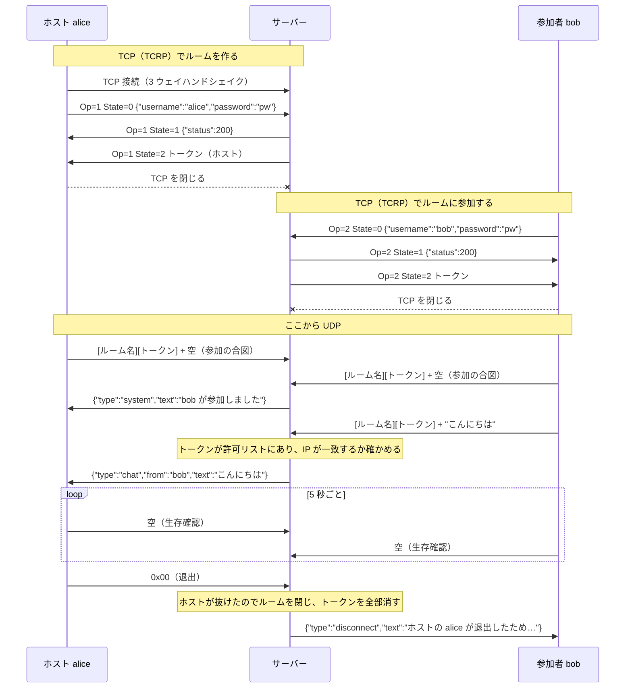

# チャットルーム（ステージ 2）

クライアントが自分でチャットルームを作ってホストになり、他の人がルーム名（とパスワード）を指定して参加する。ルームの作成・参加は TCP、ルーム内の会話は UDP で行う。Python の標準ライブラリだけで書いている。

```
tcrp.py        TCRP（ルームの作成・参加用の TCP プロトコル）の組み立てと読み取り
chatpacket.py  ルーム内チャット用の UDP パケットの組み立てと読み取り
server.py      サーバー（TCP と UDP を同じポート番号 9001 で待ち受ける）
client.py      CLI クライアント
bench.py       500 ルーム × 10 人 × 毎秒 2 通の負荷試験
```

コードのコメントにある【機能要件1.N】【機能要件2.N】【非機能要件N】は課題文の番号に対応している。課題文では 2 つ目の節（UDP）も「1.」と番号が振られているので、UDP 側を 2 と読み替えている。

## 動かし方

サーバーを起動する:

```bash
python3 udp/chatroom/server.py
```

クライアントを起動する（別のターミナルで。何人でも）:

```bash
python3 udp/chatroom/client.py
```

ユーザー名を入れたあと、`1` でルームを作成（ホストになる）、`2` で既存のルームに参加する。Ctrl-D か Ctrl-C で退出する。ホストが退出するとルームが閉じ、残っていた人はルーム選択に戻る。

負荷試験は、サーバーをメッセージごとのログなし（`-q`）で起動してから:

```bash
python3 udp/chatroom/server.py -q
```

```bash
python3 udp/chatroom/bench.py
```

## 全体の流れ



## プロトコル

### TCRP（TCP、ルームの作成・参加）

| 部分 | 大きさ | 中身 |
|---|---|---|
| RoomNameSize | 1 バイト | ルーム名のバイト数（最大 28） |
| Operation | 1 バイト | `1` = 作成、`2` = 参加 |
| State | 1 バイト | `0` = リクエスト、`1` = 応答、`2` = 完了 |
| OperationPayloadSize | 29 バイト | ペイロードのバイト数（ビッグエンディアンの整数、最大 229） |
| RoomName | RoomNameSize | UTF-8 |
| OperationPayload | OperationPayloadSize | State ごとに下の表の形式 |

| State | 向き | ペイロード |
|---|---|---|
| 0 リクエスト | クライアント → サーバー | JSON `{"username": "...", "password": "..."}`（パスワードは省略可） |
| 1 応答 | サーバー → クライアント | JSON `{"status": 200, "message": "..."}` |
| 2 完了 | サーバー → クライアント | トークン（UTF-8 の文字列）。State 1 が 200 のときだけ送る |

State 1 のステータスコード: `200` 成功、`400` リクエストが不正、`401` パスワード違い、`404` ルームがない、`409` ルーム名が使用中 / ルーム内でユーザー名が重複。

### ルーム内のチャット（UDP）

クライアント → サーバー（最大 4096 バイト）:

| 部分 | 大きさ | 中身 |
|---|---|---|
| RoomNameSize | 1 バイト | ルーム名のバイト数 |
| TokenSize | 1 バイト | トークンのバイト数 |
| RoomName | RoomNameSize | UTF-8 |
| Token | TokenSize | UTF-8 |
| Message | 残り | チャット本文（UTF-8）。空 = 参加 / 生存確認、`0x00` の 1 バイト = 退出 |

サーバー → クライアント（最大 4094 バイト、ヘッダーなし）は JSON で、`type` によって意味が変わる:

| type | 例 | 意味 |
|---|---|---|
| `chat` | `{"type":"chat","from":"bob","text":"こんにちは"}` | 他の人の発言 |
| `system` | `{"type":"system","text":"bob が参加しました"}` | 参加・退出の知らせ |
| `disconnect` | `{"type":"disconnect","text":"30 秒間送信がなかったため切断しました"}` | 切断された。トークンはもう使えないので、TCP で参加し直す |

## 課題文に書かれていないので自分で決めたこと

| 決めたこと | 理由 |
|---|---|
| TCP と UDP で同じポート番号（9001）を使う | TCP と UDP はポート番号の空間が別なので、ぶつからない。クライアントは接続先を 1 つ覚えるだけで済む |
| TCRP のペイロードは JSON、State 2 はトークンの文字列 | 課題文が「整数、文字列、JSON など」としていて、ユーザー名とパスワードを 1 つにまとめやすい |
| サーバー → クライアントのメッセージは JSON | 「ヘッダーなし」なので、発言者の名前と、発言・知らせ・切断の区別を中身に入れる必要がある。4094 バイトを超えるときは本文を文字単位で削る |
| 空のメッセージ = 参加 / 生存確認、`0x00` = 退出 | UDP のヘッダーに操作の欄がないため。入力した本文が NUL 1 文字だけになることはないので、チャットと区別できる |
| クライアントは 5 秒ごとに生存確認を送り、サーバーは 30 秒何も来ない人を外す | ステージ 1 の「しばらく送信がない人を外す」をそのままにすると、発言しないホストのせいでルームが閉じてしまう。生存確認があれば、外れるのはクライアントが落ちたときだけになる |
| トークンを受け取ったのに UDP に来ない人も、30 秒で外す | 使われないトークンが許可リストに残り続けないように |
| ユーザー名は 64 バイトまで、ルーム内で重複不可 | State 1 の応答（229 バイト以内）にユーザー名を入れて返すことがあるため。重複を許すと、誰の発言か区別できない |
| パスワードは PBKDF2 でハッシュして保存し、`hmac.compare_digest` で比べる | 平文で持たないため、また比較にかかる時間からパスワードを推測されないため |

## 負荷試験の結果（非機能要件2）

手元の Mac で `bench.py` を既定値（500 ルーム × 10 人 × 毎秒 2 通 × 5 秒）で実行した。

| 条件 | サーバーが受けた数 | 転送すべき数 | 届いた数 | サーバーの送信 |
|---|---|---|---|---|
| 毎秒 2 通（課題の条件） | 10,000 通/秒 | 450,000 | 450,000（100%） | 約 90,000 パケット/秒 |
| 毎秒 4 通（倍の負荷） | 20,000 通/秒 | 900,000 | 623,992（69.3%） | 約 123,000 パケット/秒 |

課題の条件は全部届く。余裕は 1.3 倍ほどで、それを超えると、UDP の送信バッファが一杯になった分を捨てて（非機能要件1）新しいメッセージを優先する。

## ステージ 1 からの主な違い

| | ステージ 1（[udp/chat](../chat/)） | ステージ 2 |
|---|---|---|
| 参加のしかた | いきなり UDP を送れば参加できる | TCP でトークンをもらわないと UDP で話せない |
| 相手の見分け方 | 送信元アドレスだけ | トークン + IP アドレス |
| ルーム | 1 つだけ | 名前つきで複数。パスワードもかけられる |
| サーバーの作り | 1 スレッドの UDP ループ | TCP は接続ごとのスレッド、UDP は 1 本のループ。共有する `rooms` を鍵（`threading.Lock`）で守る |
| TCP の読み方 | — | TCP には区切りがないので、固定長のヘッダーで長さを知り、その長さぶん揃うまで読む（`tcrp.recv_exact`） |

## 見どころ

### ① TCP には区切りがないので、長さぶん揃うまで読む（`tcrp.recv_exact` / `tcrp.receive`）

```python
header = recv_exact(sock, HEADER_SIZE)                      # まず固定長の 32 バイトを読む
payload_size = int.from_bytes(header[3:HEADER_SIZE], 'big')  # ヘッダーからボディの長さを知る
if payload_size > MAX_PAYLOAD_SIZE: raise ...               # 読む前に上限を確かめる
body = recv_exact(sock, room_name_size + payload_size)      # その長さぶん揃うまで読む
```

ステージ 1 の UDP では `recvfrom` 1 回で 1 メッセージがまるごと返ってきた。TCP ではそうならないので、「ヘッダーで長さを知る → 長さぶん読む」という 2 段の読み方が必要になる。

### ② 1 つのプロセスが TCP と UDP を同じ 9001 番で待ち受ける（`ChatRoomServer.__init__`）

TCP と UDP はポート番号の空間が別なので、同じ番号で bind してもぶつからない。

### ③ 鍵（Lock）と、鍵を持たずに行う重い処理（`create_room` / `join_room`）

```python
with self.lock:                                  # 短く持つ: ルームを探すだけ
    room = self.rooms.get(room_name); salt, expected = ...
if not hmac.compare_digest(hash_password(password, salt), expected):  # 重い計算は鍵なしで
    return 401 ...
with self.lock:                                  # 持ち直して、手放している間に変わっていないか確かめる
    if self.rooms.get(room_name) is not room: return 404 ...
```

TCP のスレッドが鍵を持っている間は、UDP のループが転送できない。そのため、鍵を持つ時間をできるだけ短くしている。一度手放したら、その間に他のスレッドが状態を変えたかもしれないので、持ち直したときに確かめ直す。

### ④ トークン + IP の二重チェック（`handle_packet`）

```python
member = room.members.get(token) if room else None   # 許可リストにあるか
if addr[0] != member.ip: return                      # TCP で受け取った人と同じ IP か
member.addr = addr                                   # 最初に来たアドレスを所有者にする
```

ステージ 1 では「送ってきたアドレスをそのまま登録」していた。ステージ 2 では、TCP で身元を確認してから UDP を使わせる形になっている。

### ⑤ 退出が連鎖する（`remove_member` → `close_room`）

```
remove_member(ホスト)  → トークンを消す → close_room() → 全員に disconnect を送り、全トークンを消す
remove_member(参加者) → トークンを消す → 残った人に「退出しました」を送る
```

退出の理由は 3 つある（自分で抜けた / タイムアウト / 送信の連続失敗）。どれも同じ `remove_member` を通るので、「ホストが抜けたらルームを閉じる」処理は 1 か所に書くだけで済んでいる。

### ⑥ クライアントのスレッドを自分で終わらせる（`receive_loop` / `StdinLines`）

ステージ 1 のクライアントは、終わるときにプロセスごと終了していた。ステージ 2 では、切断されたあと同じプロセスでルーム選択に戻るので、次の 2 つが必要になった。

- 入力待ちを途中でやめられるようにした。`for line in sys.stdin` は行が来るまで抜けられないので、サーバーと同じく `select` で最大 0.2 秒だけ待つ。
- 古い受信スレッドを確実に止めるようにした。0.5 秒ごとに `stop` を確かめて自分で終わる。古いスレッドが残ると、閉じたソケットの番号が新しいソケットに再利用されたとき、そのスレッドが別のルームのメッセージを読んでしまうおそれがある。

## メソッドごとのステージ 1 との違い

### サーバー

| ステージ 1（udp/chat） | ステージ 2（udp/chatroom） | 違い |
|---|---|---|
| `__init__` | `__init__` | UDP に加えて TCP のソケット（`listen`）を持つ。`rooms` と `lock` を用意する |
| `serve_forever`（中に UDP のループ） | `serve_forever` + `udp_loop` | TCP の受け付けスレッドを立ててから、UDP のループに入る。ループの中身はステージ 1 と同じで、掃除のときだけ鍵を持つ |
| — | `accept_loop` | 新規。`accept()` して、接続ごとにスレッドを立てる |
| — | `handle_tcp` | 新規。State 0 を読む → State 1 を返す →（成功なら）State 2 を返す → TCP を閉じる |
| — | `process_request` | 新規。State、Operation、ペイロードの JSON を確かめる |
| — | `create_room` / `join_room` | 新規。ルームを作る / パスワードを確かめて参加させ、トークンを発行する |
| — | `new_token` | 新規。`secrets` で推測されにくいトークンを作る |
| `receive_all` | `receive_all` | パケットの分解（`decode_request`）をここで行い、`handle_packet` だけを鍵の中で呼ぶ |
| `handle_packet` | `handle_packet` | アドレスで登録する代わりに、トークンと IP を確かめる。空の本文 = 生存確認、`0x00` = 退出、の判定が増えた。転送する中身は JSON |
| `relay` | `broadcast` + `send` | 全員ではなく同じルームの人だけに送る。1 人に送る処理を `send` に切り出し、成功 / 宛先の失敗 / 混雑で捨てた、の 3 つを返す |
| — | `remove_member` | 新規。トークンを消す、本人に切断を知らせる、ホストならルームを閉じる |
| — | `close_room` | 新規。ルームを消し、全員に切断を知らせる |
| `remove_inactive` | `remove_inactive` | ルームごとに見る。外すときは `remove_member` を通すので、切断の知らせが届く。UDP に来ないトークンも外す |

### プロトコル

| ステージ 1（protocol.py） | ステージ 2 | 違い |
|---|---|---|
| — | `tcrp.encode` / `tcrp.receive` / `tcrp.recv_exact` | 新規。TCP 用。固定長 32 バイトのヘッダーと、長さぶん揃うまで読む処理 |
| — | `tcrp.encode_json` / `decode_json` | 新規。TCRP のペイロードの JSON |
| `encode` / `decode` | `chatpacket.encode_request` / `decode_request` | ヘッダーが 1 バイト（名前の長さ）から 2 バイト（ルーム名の長さ・トークンの長さ）になった |
| — | `chatpacket.encode_event` / `decode_event` | 新規。サーバー → クライアント。ステージ 1 は受け取ったパケットをそのまま転送していたが、ステージ 2 は「ヘッダーなしの本文」を作り直すので JSON にした |

### クライアント

| ステージ 1（client.py） | ステージ 2 | 違い |
|---|---|---|
| `for line in sys.stdin` | `StdinLines` | 新規。途中でやめられる入力待ち |
| `ask_username` | `ask_username` | ほぼ同じ（上限が 64 バイトになった） |
| — | `ask_room` / `ask_password` | 新規。作成か参加かと、ルーム名・パスワードを聞く |
| — | `request_token` | 新規。TCP でトークンを受け取る（接続 → State 0 → State 1 → State 2 → 閉じる） |
| `receive_loop` | `receive_loop` | JSON の `type` で表示を変える。`disconnect` が来たら知らせる。`stop` で自分で終わる |
| — | `heartbeat_loop` | 新規。5 秒ごとに生存確認を送る |
| `main` の送信ループ | `chat` | 送信ループを関数に切り出した。退出のときは `0x00` を送る |
| `main` | `main` | 「ルームを選ぶ → チャット」を、切断されるたびに繰り返す |
