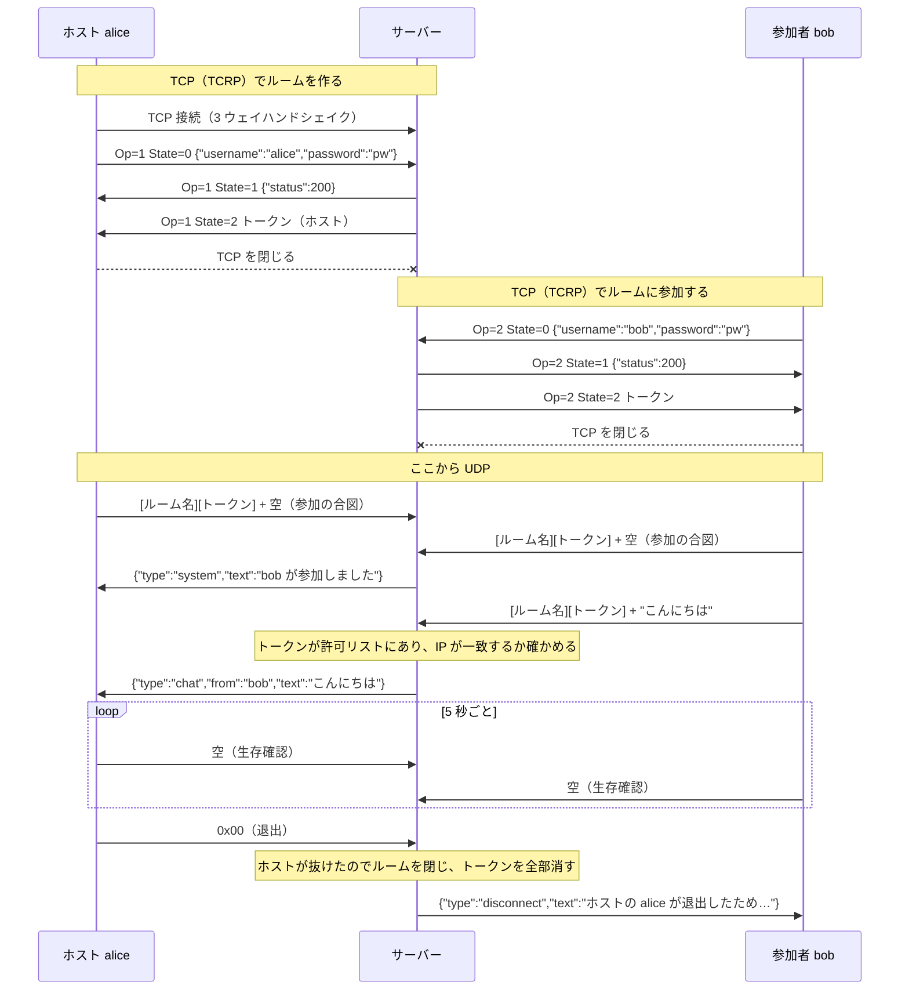

# チャットルーム（ステージ 2）

クライアントが自分でチャットルームを作ってホストになり、他の人がルーム名（とパスワード）を指定して参加する。ルームの作成・参加は TCP、ルーム内の会話は UDP で行う。Python の標準ライブラリだけで書いている。

```
tcrp.py        TCRP（ルームの作成・参加用の TCP プロトコル）の組み立てと読み取り
chatpacket.py  ルーム内チャット用の UDP パケットの組み立てと読み取り
server.py      サーバー（TCP と UDP を同じポート番号 9001 で待ち受ける）
client.py      CLI クライアント
bench.py       500 ルーム × 10 人 × 毎秒 2 通の負荷試験
```

コードのコメントにある【機能要件1.N】【機能要件2.N】【非機能要件N】は課題文の番号に対応している。課題文では 2 つ目の節（UDP）も「1.」と番号が振られているので、UDP 側を 2 と読み替えている。

## 動かし方

サーバーを起動する:

```bash
python3 udp/chatroom/server.py
```

クライアントを起動する（別のターミナルで。何人でも）:

```bash
python3 udp/chatroom/client.py
```

ユーザー名を入れたあと、`1` でルームを作成（ホストになる）、`2` で既存のルームに参加する。Ctrl-D か Ctrl-C で退出する。ホストが退出するとルームが閉じ、残っていた人はルーム選択に戻る。

負荷試験は、サーバーをメッセージごとのログなし（`-q`）で起動してから:

```bash
python3 udp/chatroom/server.py -q
```

```bash
python3 udp/chatroom/bench.py
```

## 全体の流れ



## プロトコル

### TCRP（TCP、ルームの作成・参加）

| 部分 | 大きさ | 中身 |
|---|---|---|
| RoomNameSize | 1 バイト | ルーム名のバイト数（最大 28） |
| Operation | 1 バイト | `1` = 作成、`2` = 参加 |
| State | 1 バイト | `0` = リクエスト、`1` = 応答、`2` = 完了 |
| OperationPayloadSize | 29 バイト | ペイロードのバイト数（ビッグエンディアンの整数、最大 229） |
| RoomName | RoomNameSize | UTF-8 |
| OperationPayload | OperationPayloadSize | State ごとに下の表の形式 |

| State | 向き | ペイロード |
|---|---|---|
| 0 リクエスト | クライアント → サーバー | JSON `{"username": "...", "password": "..."}`（パスワードは省略可） |
| 1 応答 | サーバー → クライアント | JSON `{"status": 200, "message": "..."}` |
| 2 完了 | サーバー → クライアント | トークン（UTF-8 の文字列）。State 1 が 200 のときだけ送る |

State 1 のステータスコード: `200` 成功、`400` リクエストが不正、`401` パスワード違い、`404` ルームがない、`409` ルーム名が使用中 / ルーム内でユーザー名が重複。

### ルーム内のチャット（UDP）

クライアント → サーバー（最大 4096 バイト）:

| 部分 | 大きさ | 中身 |
|---|---|---|
| RoomNameSize | 1 バイト | ルーム名のバイト数 |
| TokenSize | 1 バイト | トークンのバイト数 |
| RoomName | RoomNameSize | UTF-8 |
| Token | TokenSize | UTF-8 |
| Message | 残り | チャット本文（UTF-8）。空 = 参加 / 生存確認、`0x00` の 1 バイト = 退出 |

サーバー → クライアント（最大 4094 バイト、ヘッダーなし）は JSON で、`type` によって意味が変わる:

| type | 例 | 意味 |
|---|---|---|
| `chat` | `{"type":"chat","from":"bob","text":"こんにちは"}` | 他の人の発言 |
| `system` | `{"type":"system","text":"bob が参加しました"}` | 参加・退出の知らせ |
| `disconnect` | `{"type":"disconnect","text":"30 秒間送信がなかったため切断しました"}` | 切断された。トークンはもう使えないので、TCP で参加し直す |

## 課題文に書かれていないので自分で決めたこと

| 決めたこと | 理由 |
|---|---|
| TCP と UDP で同じポート番号（9001）を使う | TCP と UDP はポート番号の空間が別なので、ぶつからない。クライアントは接続先を 1 つ覚えるだけで済む |
| TCRP のペイロードは JSON、State 2 はトークンの文字列 | 課題文が「整数、文字列、JSON など」としていて、ユーザー名とパスワードを 1 つにまとめやすい |
| サーバー → クライアントのメッセージは JSON | 「ヘッダーなし」なので、発言者の名前と、発言・知らせ・切断の区別を中身に入れる必要がある。4094 バイトを超えるときは本文を文字単位で削る |
| 空のメッセージ = 参加 / 生存確認、`0x00` = 退出 | UDP のヘッダーに操作の欄がないため。入力した本文が NUL 1 文字だけになることはないので、チャットと区別できる |
| クライアントは 5 秒ごとに生存確認を送り、サーバーは 30 秒何も来ない人を外す | ステージ 1 の「しばらく送信がない人を外す」をそのままにすると、発言しないホストのせいでルームが閉じてしまう。生存確認があれば、外れるのはクライアントが落ちたときだけになる |
| トークンを受け取ったのに UDP に来ない人も、30 秒で外す | 使われないトークンが許可リストに残り続けないように |
| ユーザー名は 64 バイトまで、ルーム内で重複不可 | State 1 の応答（229 バイト以内）にユーザー名を入れて返すことがあるため。重複を許すと、誰の発言か区別できない |
| パスワードは PBKDF2 でハッシュして保存し、`hmac.compare_digest` で比べる | 平文で持たないため、また比較にかかる時間からパスワードを推測されないため |

## 負荷試験の結果（非機能要件2）

手元の Mac で `bench.py` を既定値（500 ルーム × 10 人 × 毎秒 2 通 × 5 秒）で実行した。

| 条件 | サーバーが受けた数 | 転送すべき数 | 届いた数 | サーバーの送信 |
|---|---|---|---|---|
| 毎秒 2 通（課題の条件） | 10,000 通/秒 | 450,000 | 450,000（100%） | 約 90,000 パケット/秒 |
| 毎秒 4 通（倍の負荷） | 20,000 通/秒 | 900,000 | 623,992（69.3%） | 約 123,000 パケット/秒 |

課題の条件は全部届く。余裕は 1.3 倍ほどで、それを超えると、UDP の送信バッファが一杯になった分を捨てて（非機能要件1）新しいメッセージを優先する。

## ステージ 1 からの主な違い

| | ステージ 1（[udp/chat](../chat/)） | ステージ 2 |
|---|---|---|
| 参加のしかた | いきなり UDP を送れば参加できる | TCP でトークンをもらわないと UDP で話せない |
| 相手の見分け方 | 送信元アドレスだけ | トークン + IP アドレス |
| ルーム | 1 つだけ | 名前つきで複数。パスワードもかけられる |
| サーバーの作り | 1 スレッドの UDP ループ | TCP は接続ごとのスレッド、UDP は 1 本のループ。共有する `rooms` を鍵（`threading.Lock`）で守る |
| TCP の読み方 | — | TCP には区切りがないので、固定長のヘッダーで長さを知り、その長さぶん揃うまで読む（`tcrp.recv_exact`） |
